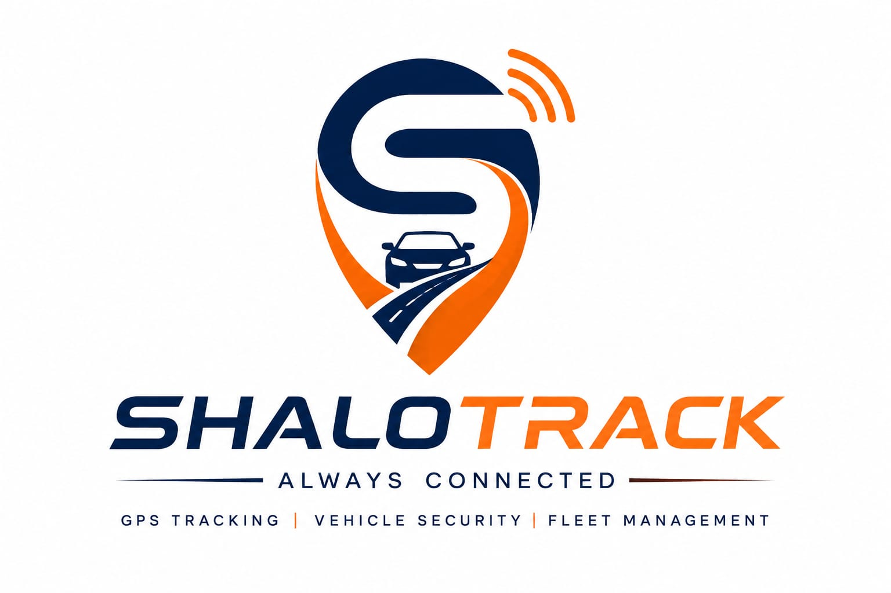

<div align="center">


<br/>



<br/><br/>

[](https://git.io/typing-svg)

<br/>


&nbsp;

&nbsp;


<br/><br/>

</div>

---

## 🌍 About ShaloTrack

ShaloTrack is a Sri Lankan GPS tracking and vehicle security platform providing **real-time vehicle tracking**, **fleet management**, and **intelligent monitoring solutions** for businesses and individual vehicle owners.

<br/>

> 💬 *Our goal is to make vehicle tracking simpler, faster, and more reliable through modern technology and innovative software solutions.*

---

## 🚗 What We Track

<br/>

<div align="center">

<table>
<tr>
<td align="center" width="160">
<br/>
</td>
<td align="center" width="160">
<br/>
</td>
<td align="center" width="160">
<br/>
</td>
</tr>
<tr>
<td align="center" width="160">
<br/>
</td>
<td align="center" width="160">
<br/>
</td>
<td align="center" width="160">
<br/>
</td>
</tr>
</table>

</div>

<br/>

---

## 📱 Platform Ecosystem

<br/>

<div align="center">

```
┌─────────────────────────────────────────────────────────────────────┐
│                     SHALOTRACK PLATFORM                             │
├──────────────────┬──────────────────┬──────────────┬───────────────┤
│  📲 Mobile App   │  🖥 Customer      │  🛡 Admin    │  🛰 GPS       │
│                  │     Portal       │    Portal    │  Infrastructure│
├──────────────────┼──────────────────┼──────────────┼───────────────┤
│ ◉ Live Tracking  │ ◉ Live Dashboard │ ◉ Customers  │ ◉ TCP Server  │
│ ◉ Route Playback │ ◉ Monitoring     │ ◉ Devices    │ ◉ GT06 Proto  │
│ ◉ Notifications  │ ◉ Analytics      │ ◉ Dealers    │ ◉ V5 Support  │
│ ◉ Fleet Mgmt     │                  │ ◉ Reports    │ ◉ Real-Time   │
│ ◉ Subscriptions  │                  │ ◉ Billing    │ ◉ Commands    │
└──────────────────┴──────────────────┴──────────────┴───────────────┘
```

</div>

<br/>

---

## 🛠 Technology Stack

<br/>

<div align="center">

### 📱 Mobile


<br/>

### ⚙️ Backend


<br/>

### 🌐 Web


<br/>

### ☁️ Database & Cloud


<br/>

### 🔗 Services & Integrations


</div>

<br/>

---

## 🎯 Vision

<br/>

<div align="center">

```
╔══════════════════════════════════════════════════════════════════╗
║                                                                  ║
║   To become Sri Lanka's leading GPS tracking and fleet           ║
║   management technology provider by delivering secure,           ║
║   scalable, and innovative vehicle monitoring solutions.         ║
║                                                                  ║
╚══════════════════════════════════════════════════════════════════╝
```

</div>

<br/>

---

## 👤 Founder & Owner

<br/>

<div align="center">


**ShaloTrack Lanka (Pvt) Ltd**

</div>

<br/>

---

## 💻 Development Team

<br/>

<div align="center">


</div>

<br/>

---

## 📍 Headquarters

<br/>

<div align="center">

🇱🇰 **Sri Lanka**

<br/>


<br/><br/>


</div>
